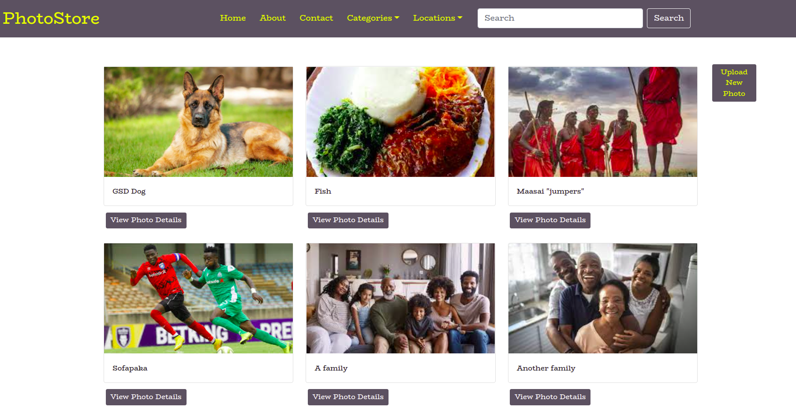
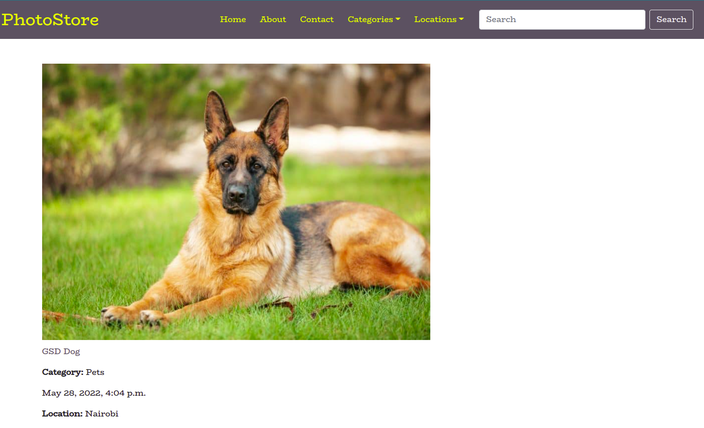
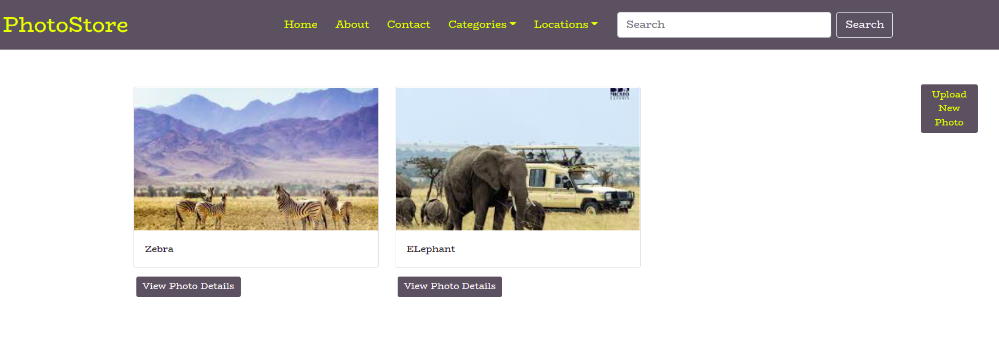

# Personal Photo Gallery (PhotoStore)

PhotoStore is a photo web application for uploading  photos and allowing others to see them online. Visitors of the website can see many photos on the home page, and can view more details of each photo using the 'view photo details' feature that opens the specific image on a new page displaying more details about it (name of photo, category, location where it was taken, and a dexcription of the photo). 

# By **Robert Kirui**

May 30, 2022.

# Description

I always get to take very good photos both when visiting interesting places and when hanging out with my family or friends. While I can keep these photos in my local storage devices and access them whenever I want, it also be good to share them with othe people. This is the reason why I developed PhotoStore, a web application where I share some of the good photos that I take with other people. Built with Django, this application allows me to add photos from the admin page and include photo details such as location where the photo was taken, the name of the photo (any name I wish to give it), and a short description of the photo. These details will be seen by the users. I also included a feature to upload photos from the front-end while also providing the details of photo. Because the photos can be so many on the home page, I included a feature for users to filter the images based on category (such as travel, family, food, sports, etc.). In addition, users can also filter the images based on location (where photos were taken).

# User Stories
- As a user, I want to view different photos that interest me.
- As a user, I want to click on a single photo to expand it and also view the details of the photo. The photo details must appear on a modal within the same route as the main page.
- As a user, I want to search for different categories of photos. (ie. Travel, Food).
- As a user, I want to copy a link to the photo to share with my friends.
- As a user, I want to view photos based on the location they were taken.

# Screenshots 
### home page

### photo details page

### 'view by category' page

# Behaviour Driven Development (BDD) 
- Scenario 1: User wants to view different photos
  * GIVEN the user is on the home page of the application 
  * THEN the user can see different photos displayed in no order or category.

- Scenario 2: User wants to view photo details
  * GIVEN the user is on the home page of the application or in the categories page 
  * WHEN the user clicks the "view photo details" button  
  * THEN the user is directed to a new page that displays the details (name of photo, date taken, location taken, and description) of the specific photo.

- Scenario 3: User wants to view photos under a specific category 
  * GIVEN the user is on the home page of the application
  * AND the user has clicked the "Categories" tab in the top navigation bar
  * WHEN the user sees a drop down menu of different categories
  * AND the user clicks a category of interest (such as travel, food, family, etc.)  
  * THEN the user will see photos under that specific category displayed on the home page.

- Scenario 4: User wants to view photos taken in a specific location  
  * GIVEN the user is on the home page of the application
  * AND the user has clicked the "Locations" tab in the top navigation bar
  * WHEN the user sees a drop down menu of different locations
  * AND the user clicks a location of interest (such as Nairobi, Nakuru, Kericho, etc.)  
  * THEN the user will see photos taken in that specific location displayed on the home page.

# Setup/Installation

- Fork the project from this repo
- Run git clone https://github.com/Kirugik/photostore.git to have the project files in your preferred directory on the local machine.
- Change directory into the specific folder containing the project files.
- Run 'pip install -r requirements.txt' to install the project dependencies.
- Run the project in the terminal using: 'python3.8 manage.py runserver'

# Technologies Used

Python, Django, HTML, CSS, heroku

# License

- Licensed under the [MIT License] (LICENSE).

Copyright (c) 2022. **Robert Kirui**